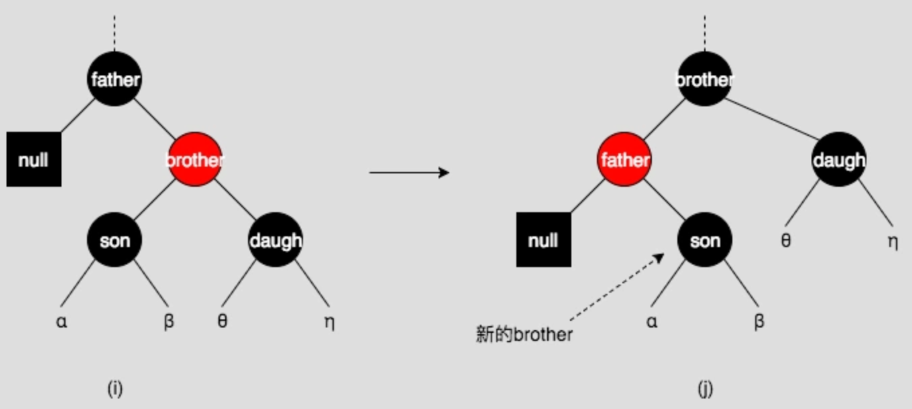

# Red Black Tree
Definition:
1. 结点要么是黑的要么是红的；
2. 所有Nil结点（叶子结点）都是黑的；
3. 红色结点不能有红色孩子；
4. 从任意结点出发，到达Nil结点所经过的黑色结点数目相同；
5. *结论*: 如果结点N只有一个孩子，它这个孩子必为红色，否则它违反了4。
6. 至于根结点要不要是黑色，作者们给出的定义不同，无论根结点是什么颜色都不违反4，它的颜色可随意变化。

## Insert
首先将待插入结点记为红色，然后一定可以找到一个叶子结点的位置(原Nil)把它插入进去。
这样它没有违反4， 但是由于可能违反了3， 所以由此插入结点向上开始调整。
记插入结点为 $z$，以下只考虑 $z$ 的父结点是祖父结点的左子孩子的情况；
需要调整时满足 $z.p.color==red$
右子孩子情况完全类似。
- **情况1: $z$ 的叔叔结点为红色，** 此时由于原树要满足红黑树的性质，则祖父结点一定为黑色。所以将祖父结点的黑色下放给它的两个孩子，祖父结点自己变成红色，则从祖父结点开始的子树满足性质。将祖父结点设置为待调整结点，进入下一次循环。
- **情况2: $z$ 的叔叔结点为黑色，$z$ 是它父结点的右孩子。** 将 $z$ 设置为它的父结点，对 $z$ 左旋。此时由原本的 红： （左）黑， （右 $z$ ）红 变为 红： （左 $z$ ）红，（右）黑。 这依然违反了3，统一由情况3来处理。
- **情况3: $z$ 的叔叔结点为黑色，$z$ 是它父结点的左孩子。** 将 $z$ 的父结点设为黑，$z$ 的祖父设置为红，对 $z$ 的祖父结点右旋。进入下一次循环。

## Delete
### 1. 如果被删结点无子结点，且被删结点为红色。
此时可直接删除而不破坏任何性质
### 2. 被删结点无子结点，且被删结点为黑色
#### 2.1 brother为黑色，brother有与其方向一致的son

NULL为被删除结点，在调整过程中保留一个黑色权值。father与brother旋转，重新染色。此黑色游离权值可扔掉。
#### 2.2 brother为黑色，有与其方向不一致的红色

将son与brother旋转并重新染色，转化为2.1。
#### 2.3 brother为黑色，且brother无红色子结点
##### 2.3.1 若father为红

则重新染色即可。
##### 2.3.2 若father为黑

将brother染红，此时游离的的黑色权值暂存在father中。将father（其所代表的游离权值）作为新的被删除结点进行情况判断。如果有2.1, 2.2 则可进行相应操作扔掉此游离权值。如果没有则一直上溯直到根结点，此时游离的黑色权值被扔到了树外面
#### 2.4 brother为红色，则father必为黑色

将brother与father旋转，重新上色（brother与father颜色互换），新的brother（原brother的son）必为黑色。于是成为2.1, 2.2, 2.3中的情形。（黑色下放）
### 3. 被删结点只有一个子结点，被删结点为黑色
因为性质5，所以子结点必然为红色，此时用子结点代替被删除结点，并染黑。
### 4. 被删结点有两个子结点，后继结点无右子树
使用后继结点（右子树中最小的）代替被删除结点， 颜色染为被删除结点颜色。此时问题转换为删除后继结点（1或2）。
### 5. 被删除结点有两个子结点，后继结点有右子树
类似4，此时问题转化为3.

**不存在红结点只有一个黑孩子的情况，这违反了性质4**